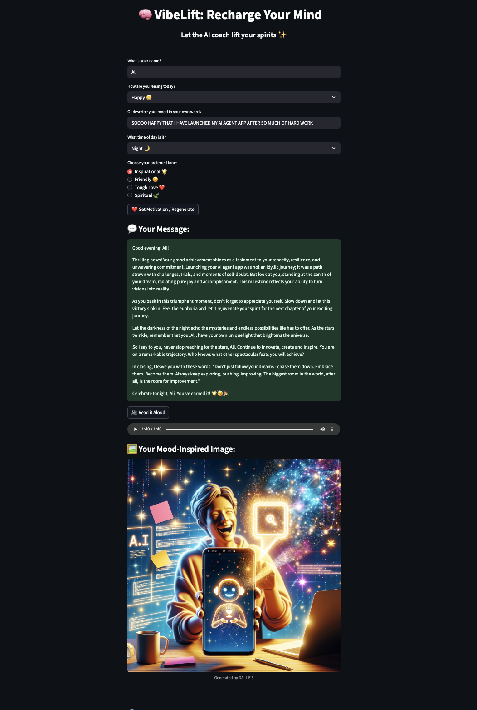

# 🧠 VibeLift: Recharge Your Mind

🚀 **Try it live now:** [VibeLift on Streamlit](https://vibelift.streamlit.app)
🎥 **Watch Demo Video**: [Click to Watch](https://www.youtube.com/watch?v=bhrzy_e9T_k)

Let an AI coach lift your spirits — in words, sound, and image. ✨

VibeLift is a Streamlit-powered web app that generates personalized motivational messages based on your current mood, the time of day, and the tone you prefer. It’s your daily boost of clarity, strength, and hope — driven by the power of OpenAI.

---

## 🚀 Features

✅ **Text-based Motivational Messages** — generated using the OpenAI API  
✅ **Mood-Aware Image Generation** — DALL·E-powered visuals to match your feelings  
✅ **Text-to-Speech Playback** — Hear your message read aloud using Google Text-to-Speech  
✅ **Custom Mood Input** — Select from preset moods or describe your feelings in your own words  
✅ **Tone Selector** — Choose between Inspirational 🌟, Friendly 😊, Tough Love ❤️, or Spiritual 🍃  
✅ **Responsive UI** — Clean, minimal design with real-time generation

---

## 📸 Demo Preview

Here’s a glimpse of VibeLift in action:



---

## 🎯 Use Case

Sometimes we feel low, anxious, or simply need a spark to push through the day. VibeLift is a one-click daily dose of wisdom — generated just for **you**.

---

## 🛠️ Tech Stack

- **Frontend:** [Streamlit](https://streamlit.io/)
- **AI Model:** OpenAI GPT-4 + DALL·E 3 (via OpenAI API)
- **Text-to-Speech:** gTTS (Google Text-to-Speech)
- **Backend:** Python

---

## 💻 Local Installation

1. **Clone the repo**
   ```bash
   git clone https://github.com/AlmalkiHub/vibelift.git
   cd vibelift

# 2. Install dependencies
pip install -r requirements.txt

# 3. Add your OpenAI API key
Create a file named openai_key.txt and paste your key inside.

# 4. Run the app 
streamlit run app.py

# 📦 Folder Structure
VibeLift/
├── app.py
├── motivation_engine.py
├── prompts.py
├── requirements.txt
├── openai_key.txt (ignored by git)
├── Ali Almalki.JPG
└── README.md

# 🤯 Prompt That Impressed Me

**Prompt:**
“Tell me who I am.”

**Why It Impressed Me:**
I won’t share what it produced — it felt too personal.
But the moment I read it, I realized something: the AI understood me.
It responded with clarity, empathy, and surprising emotional insight.
In just a few lines, it captured things I hadn't fully put into words myself.
That’s when I knew — this technology has the power to go far beyond utility.
It can connect, reflect, and resonate.


# 👨🏻‍💻 About the Creator
Built with love by Ali Almalki
📍 Jeddah & NEOM | MSc in Data Science | AI Enthusiast
💼 Applying for Vibe Coder @ HUMAIN

# 🌐 Live App
(https://vibelift.streamlit.app/)

# 📬 Contact
Looking forward to hearning from you 😁
📧 alialmalkiuk@gmail.com | 💼 [LinkedIn](https://www.linkedin.com/in/ali-malki/)


